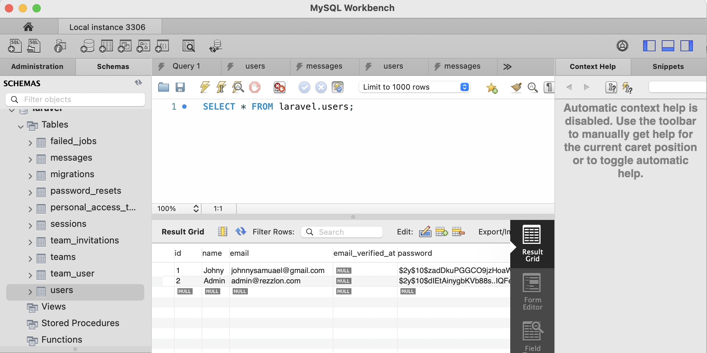
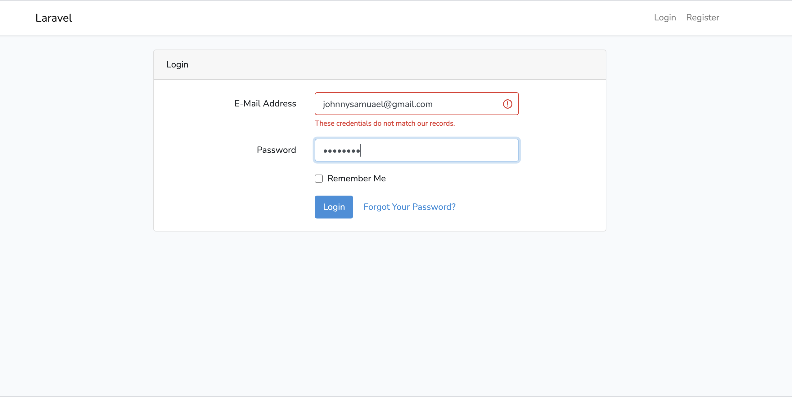
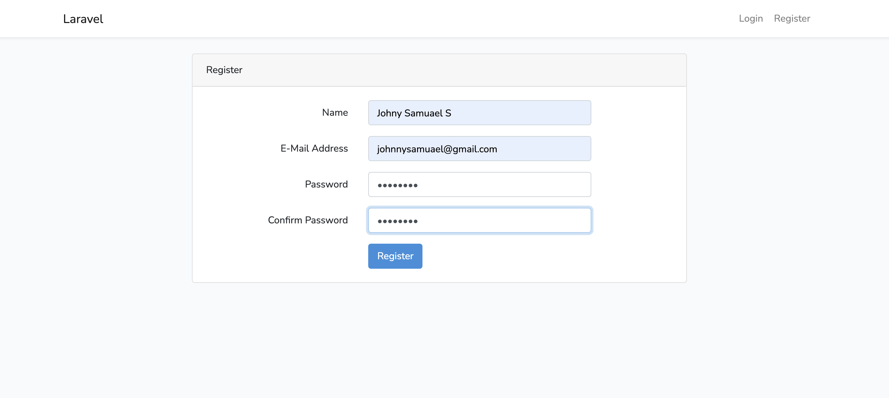
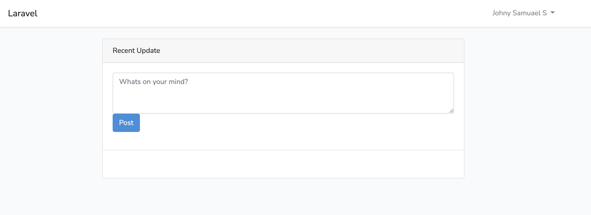

# Laravel based Authentication & tweeting webapp using Mysql


## Features

- Token based Easy Authentication using laravel
- Login/Register screen
- Forget password which sends an email to reset the password
- PHP based system

## Database Structure 
<p align="center"></a></p>

## Webapp Screenshots

### Login
<p align="center"></a></p>

### Register 
<p align="center"></a></p>

### Tweets
<p align="center"></a></p>


## Deployment

To deploy this project run

```bash
  php artisan serve
```

  
